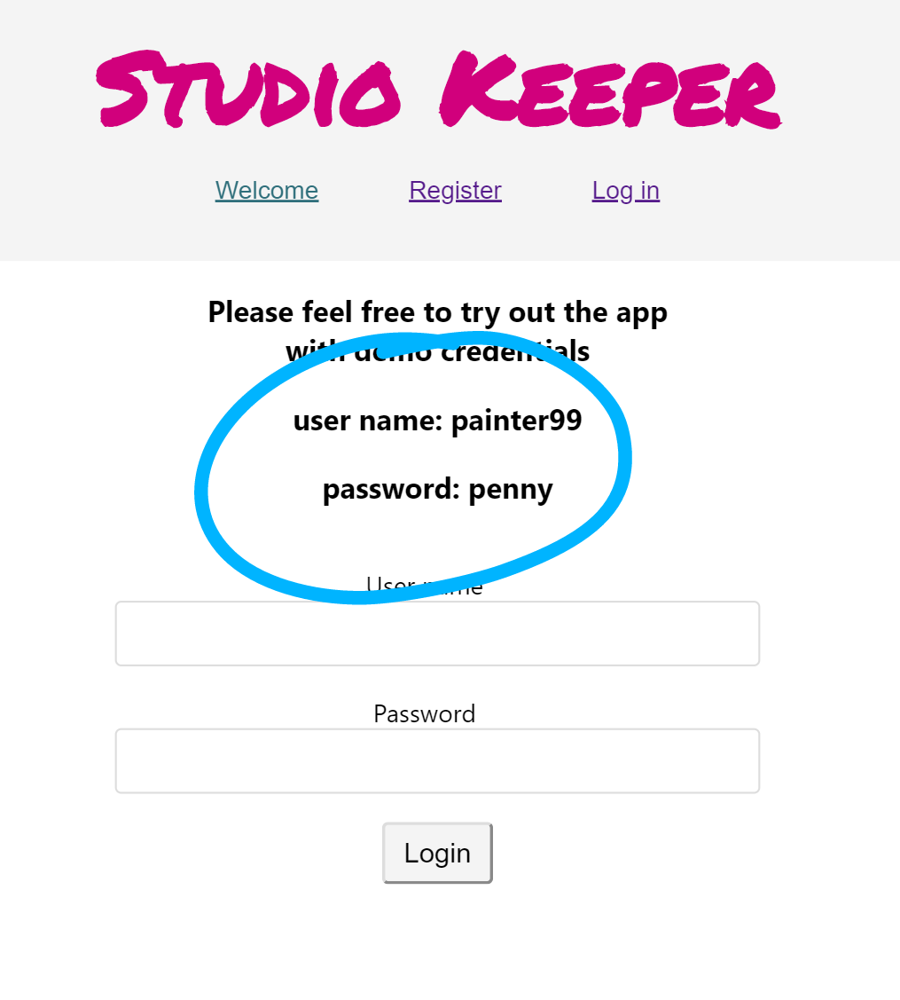
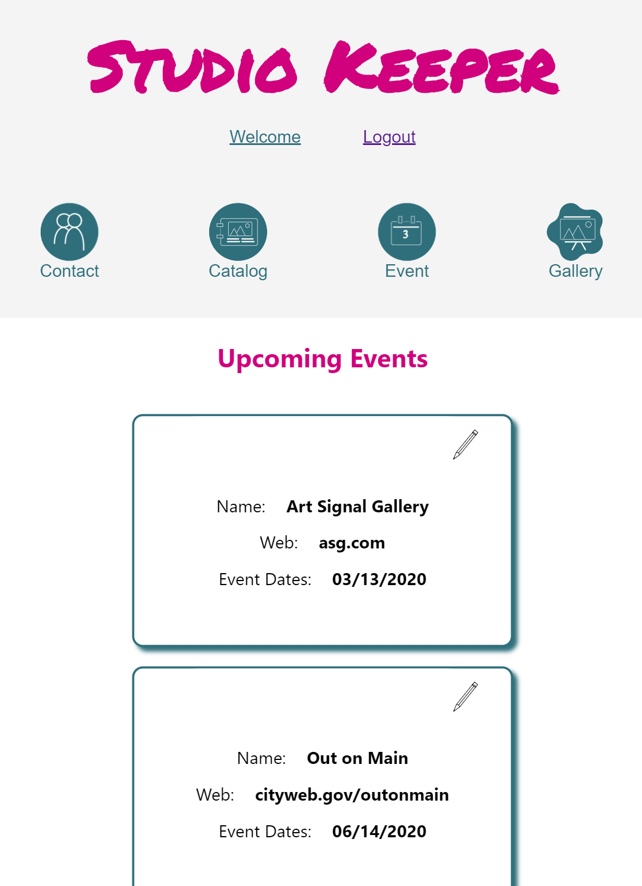
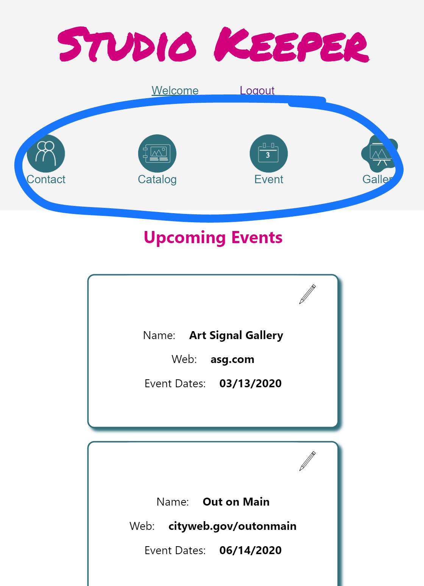

# Studio Keeper

Studio Keeper is a web application designed to support artists, makers, and designers manage the business of their creative work.  The application allows users to easily catalog their work, enter contacts, and keep track of events of interest.  The application also provides a gallery view, which allows users to easily share their work.  

Live Link: [Studio Keeper](https://studio-keeper-app.now.sh/)
Client Repo: [Client Repo](https://github.com/sheilajmj/studio-keeper-app)
Api Repo: [API Repo](https://github.com/sheilajmj/studio-keeper-server)

## Getting Started
Upon first arriving to the site, you will see the welcome page.  Here you may click the 'get started' button or the 'login' button to continue.

To view the project in action, you will need to log in using the demo account.  
Username: painter99
password: penny

## Using the App

Once logged in, users will see the application landing page.  

Users may click an icon along the top menu to view a preview of the entries.

The user will see several options from here.  Options include, viewing entry details, adding an entry, editing an entry, selecting a different icon from the main menu to view a new category or to view the gallery, and returing to the application landing page.

### Adding an Entry

Selecting to add an entry will allow the user to enter information, and choose 'submit' to commit the new entry to the database.  

### Editing an Entry

Selecting to edit an entry will allow the user to make changes to the selected entry.  The user has options to submit the changes to the database, cancel the changes, or delete the entire entry from the database.  

## The Gallery

The gallery page is a minimal view of the catalog entries, designed to serve as a tool for showcasing work.  To allow the focus to be on the catalog images, the additional navigation options are not present.  However, by clicking the title at the top, a user may return to the main application landing page.  

 

## Deployment

The server and client application are deployed to Heroku.  Image storage is managed in AWS S3.  

## Built With

 The frontend was created using React

 The backend was created using Node

 The database used was Postgres

 Images are stored using AWS S3

## Authors

* **Sheila Jagla** - [SheilaJagla](https://github.com/sheilajmj)

## Acknowledgments

####Stock Images
    * Paweł Czerwiński on Unsplash
    * Mr Karl on Unsplash
    * Alexander Ant on Unsplash

